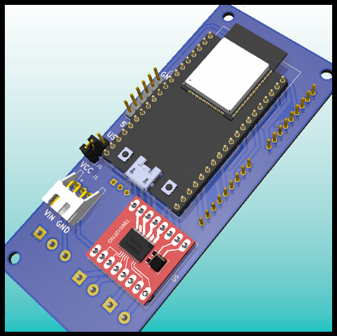
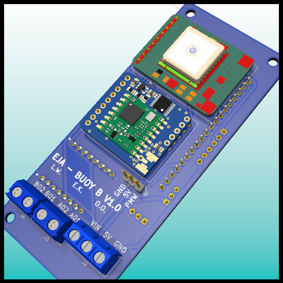
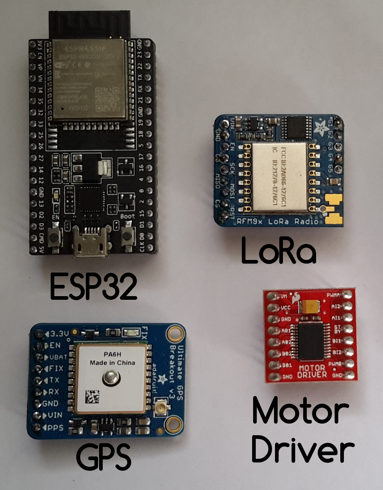
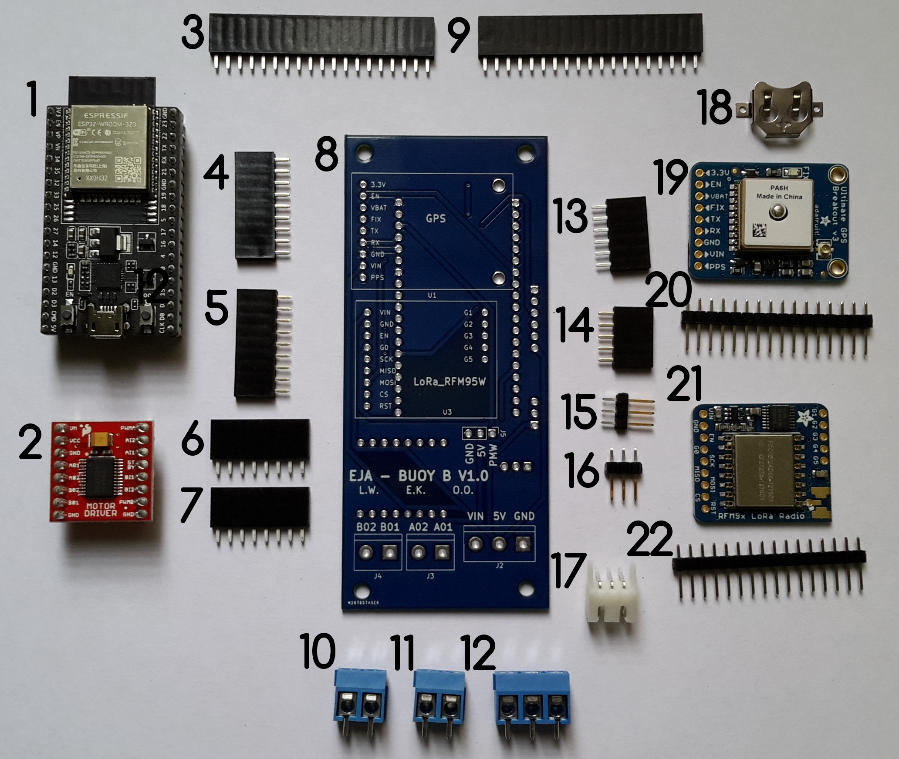

# EJA Intelligent Buoy B - Electronic Design

EJA Intelligent Buoy B - Electronic Design - [2020 Hackaday Dream Team Challenge for Conservation X Labs](https://hackaday.io/project/173457-2020-hdp-dream-team-conservation-x-labs)

Buoy B V1.0 is a 102.46 mm x 44.20 mm PCB that integrates 4 main components (ESP32, LoRa, GPS and Motor Driver).

This repository contains the KiCad design for the PCB of the Intelligent Buoy B. It also contains the 3D models used to visualize the design in the KiCad 3D viewer.

## Main Components ##

Sources:

- [ESP32-DEVKITC-32D](https://www.digikey.com/product-detail/es/espressif-systems/ESP32-DEVKITC-32D/1965-1000-ND/9356990)
- [RFM95W LoRa Radio](https://www.digikey.com/product-detail/es/adafruit-industries-llc/3072/1528-1667-ND/6005357)
- [TB6612FNG MOTOR DRIVER BOARD](https://www.digikey.com/product-detail/es/sparkfun-electronics/ROB-14450/1568-1755-ND/7915576)
- [Adafruit Ultimate GPS](https://www.digikey.com/product-detail/es/adafruit-industries-llc/746/1528-1153-ND/5353613)

## Schematic ##

[For a detailed explanation of the schematic visit the following log.](https://hackaday.io/project/173457/log/181832-buoy-b-v10-schematic-and-pcb-design)

## PCB Layout ##

## Assembly ##

Components List:

1. [ESP32-DEVKITC-32D](https://www.digikey.com/product-detail/es/espressif-systems/ESP32-DEVKITC-32D/1965-1000-ND/9356990)
2. [TB6612FNG MOTOR DRIVER BOARD](https://www.digikey.com/product-detail/es/sparkfun-electronics/ROB-14450/1568-1755-ND/7915576)
3. [CONN HDR 19POS 0.1 TIN PCB](https://www.digikey.com/product-detail/es/sullins-connector-solutions/PPTC191LFBN-RC/S7017-ND/810157)
4. [CONN HDR 9POS 0.1 GOLD PCB](https://www.digikey.com/product-detail/es/sullins-connector-solutions/PPPC091LFBN-RC/S7042-ND/810181)
5. [CONN HDR 9POS 0.1 GOLD PCB](https://www.digikey.com/product-detail/es/sullins-connector-solutions/PPPC091LFBN-RC/S7042-ND/810181)
6. [CONN HDR 8POS 0.1 TIN PCB](https://www.digikey.com/product-detail/es/sullins-connector-solutions/PPTC081LFBN-RC/S7006-ND/810147)
7. [CONN HDR 8POS 0.1 TIN PCB](https://www.digikey.com/product-detail/es/sullins-connector-solutions/PPTC081LFBN-RC/S7006-ND/810147)
8. PCB Buoy B V1.0
9. [CONN HDR 19POS 0.1 TIN PCB](https://www.digikey.com/product-detail/es/sullins-connector-solutions/PPTC191LFBN-RC/S7017-ND/810157)
10. [TERM BLK 2P SIDE ENT 5.08MM PCB](https://www.digikey.com/product-detail/es/on-shore-technology-inc/OSTTC022162/ED2609-ND/614558)
11. [TERM BLK 2P SIDE ENT 5.08MM PCB](https://www.digikey.com/product-detail/es/on-shore-technology-inc/OSTTC022162/ED2609-ND/614558)
12. [TERM BLK 3P SIDE ENT 5.08MM PCB](https://www.digikey.com/product-detail/es/on-shore-technology-inc/OSTTC032162/ED2610-ND/614559)
13. [CONN HDR 6POS 0.1 TIN PCB](https://www.digikey.com/product-detail/es/sullins-connector-solutions/PPTC061LFBN-RC/S7004-ND/810145)
14. [CONN HDR 5POS 0.1 GOLD PCB](https://www.digikey.com/product-detail/es/sullins-connector-solutions/PPTC051LFBN-RC/S6103-ND/807239)
15. [CONN HEADER VERT 3POS 2.54MM](https://www.digikey.com/product-detail/es/jst-sales-america-inc/S2B-XH-A-1-LF-SN/455-4226-ND/9961922)
16. [CONN HEADER VERT 3POS 2.54MM](https://www.digikey.com/product-detail/es/jst-sales-america-inc/S2B-XH-A-1-LF-SN/455-4226-ND/9961922)
17. [CONN HEADER R/A 3POS 2.5MM](https://www.digikey.com/product-detail/es/jst-sales-america-inc/S3B-XH-A-1-LF-SN/455-2954-ND/1556255)
18. Coin cell holder (included in [Adafruit Ultimate GPS](https://www.digikey.com/product-detail/es/adafruit-industries-llc/746/1528-1153-ND/5353613))
19. [Adafruit Ultimate GPS](https://www.digikey.com/product-detail/es/adafruit-industries-llc/746/1528-1153-ND/5353613)
20. CONN HDR 16POS 0.1 TIN PCB (included in [Adafruit Ultimate GPS](https://www.digikey.com/product-detail/es/adafruit-industries-llc/746/1528-1153-ND/5353613))
21. [RFM95W LoRa Radio](https://www.digikey.com/product-detail/es/adafruit-industries-llc/3072/1528-1667-ND/6005357)
22. CONN HEADER VERT 16POS 2.54MM (included in [RFM95W LoRa Radio](https://www.digikey.com/product-detail/es/adafruit-industries-llc/3072/1528-1667-ND/6005357))

[For a detailed Bill of Materials visit the following log.](https://hackaday.io/project/173457/log/183762-buoy-b-v10-bill-of-materials)

[For a detailed explanation about the soldering and assembly procedure visit the following log.](https://hackaday.io/project/173457/log/183666-buoy-b-v10-assembly)

## Wiring Diagrams ##

### Battery Management ###

The original design of the board considered the following components:

- Battery (5V < Voltage < 15V)
- PCB Board Buoy B V1.0
- Buck Converter
- Switch
- Extra capacitor

Also, there is an alternative for the battery management, is possible to provide the required voltages with a boost converter and a 3.7V Battery, like the following example:

- 3.7V 1 Cell Battery
- PCB Board Buoy B V1.0
- Boost Converter
- Micro USB Breakout Board
- Switch
- Extra capacitor
- JST-XH 2 Pos female connector and a JST-XH 2 Pos male connector
- 5V Charger (only used to charge the battery)

This alternative is valid and possible, but is not ideal for longer working time (compared to the first one). It is important to consider the efficiency of the boost converter. The selected boost converter will have a voltage drop at a current higher than 500mA, that should be taken into consideration.

### Motors ###

The board was designed to handle 3 different types of motors, those are:

- Servo Motor

- Stepper Motor (using the driver TB6612FNG)

- DC Motor (using the driver TB6612FNG)

[For more information about the wiring diagrams and the project visit the following log.](https://hackaday.io/project/173457/log/182722-buoy-b-v10-wiring-diagrams)
