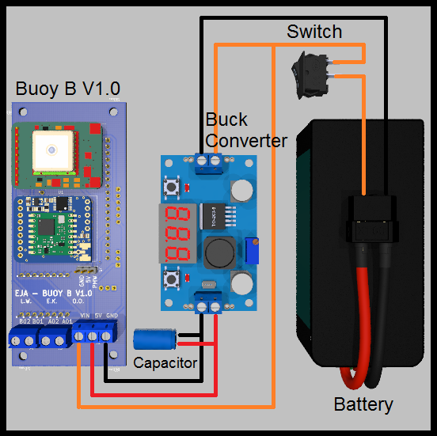

# EJA Intelligent Buoy B - Electronic Design

EJA Intelligent Buoy B - Electronic Design - 2020 Hackaday Dream Team Challenge for Conservation X Labs

This repository contains the KiCad design for the PCB of the Intelligent Buoy B. It also contains the 3D models used to visualize the design in the KiCad 3D viewer.

## Main Components ##

## Schematic ##

## PCB Layout ##

## Assembly ##

## Wiring Diagrams ##

